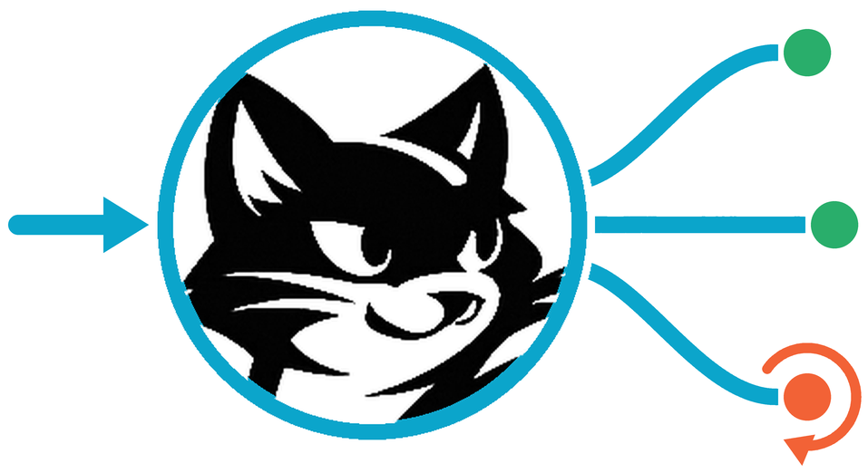

<p align="center">
  
</p>

<h1 align="center">Felix Webhook Relay</h1>

<p align="center">
  A self-hosted webhook relay built on <a href="https://github.com/GetFelix/felix">Felix</a>.
</p>

Felix Webhook Relay sits between the services that send you webhooks and the
endpoints that handle them. It verifies each incoming webhook's signature,
stores it durably before answering the sender, and delivers it to each of your
endpoints signed, with retries and backoff. When an endpoint is down, its
webhooks wait until it comes back; when it keeps refusing one, that webhook is
set aside where you can redrive it. Any endpoint can replay a time range after
an outage. It is for teams that receive webhooks from GitHub, Stripe or their
own services and want delivery they can inspect and replay on their own
machines.

Every webhook a source accepts is a record on a one-shard durable
[stream](https://github.com/GetFelix/felix/blob/main/docs/semantics.md), written
through Felix's idempotent producer. Each endpoint reads that stream through
its own
[consumer group](https://github.com/GetFelix/felix/blob/main/docs/projections.md#queues-read-the-log-through-a-shared-cursor),
which gives it a cursor, acknowledgements and redelivery, so a backlog is the
part of the log its cursor has not reached. Replay is a read of the same
stream from an earlier offset. Configuration, idempotency keys and endpoint
health are
[cache](https://github.com/GetFelix/felix/blob/main/docs/cache-on-log.md) entries,
the idempotency keys with a TTL, and the dashboard's counts are
[counters](https://github.com/GetFelix/felix/blob/main/docs/projections.md#counters).
Each relay tenant is a Felix namespace, reached only with tokens the control
plane
[narrows](https://github.com/GetFelix/felix/blob/main/docs/auth.md#control-plane-token-exchange-flow)
to it, and a source's stream can be replicated across brokers so a broker can
fail without losing what was acknowledged.

## Features

- Intake over HTTP that verifies Standard Webhooks, GitHub, Stripe and generic
  HMAC signatures before anything is stored, and answers `202` only once the
  webhook is durable.
- Deduplication of sender retries on the sender's event id.
- Delivery signed with Standard Webhooks, so receivers verify with an existing
  library.
- Ordered delivery per endpoint, or unordered with a window of requests in
  flight, filtered by event type, starting at the source's tail or backfilling
  from its start.
- An endpoint that is down pauses and is probed on a backoff schedule while its
  backlog waits. One that keeps refusing a webhook sends it to a dead-letter
  stream, and one that answers `410` or fails for three days is disabled until
  an operator enables it.
- Replay of any endpoint over a time or offset range, beside live delivery, and
  redrive or discard of dead letters.
- Many tenants in one process, each confined to its own Felix namespace by the
  broker.
- An admin page and a JSON API, with admins signing in through OpenID Connect.
- Delivery spread over several processes by hashing endpoint ids.
- Prometheus metrics for each hop: intake, the group poll, and the outbound
  request.

## Quick start

You need Docker with Compose 2.20 or later. The compose install runs the relay
with a Felix broker and control plane and nothing else, plus Dex as a stand-in
sign-in for a first run:

```bash
git clone --depth 1 https://github.com/GetFelix/felix-webhook-relay
cd felix-webhook-relay/deploy/compose
sed -i.bak "s|^RELAY_SECRET_KEY=.*|RELAY_SECRET_KEY=$(openssl rand -base64 32)|" .env
docker compose up -d --wait
```

Open <http://127.0.0.1:8090/admin/acme> and sign in as `alice@example.com` with
the password `password`. The page creates sources and endpoints, shows health,
lag and counts, and replays, retries, redrives and rotates secrets.

The same actions are a JSON API under `/api/<tenant>/`, which takes an ID token
as a bearer token. Create a source and an endpoint (the endpoint URL is
reached from inside the relay's container):

```bash
token=$(curl -s -u relay-admin:dev-admin-secret http://127.0.0.1:5556/dex/token \
  -d grant_type=password -d username=alice@example.com -d password=password \
  -d scope='openid email' | jq -r .id_token)
api() { curl -s -H "authorization: Bearer $token" -H 'content-type: application/json' "$@"; }
api -X PUT -d '{"scheme": {"type": "token"}}' http://127.0.0.1:8090/api/acme/sources/demo
api -X PUT -d '{"source": "demo", "url": "https://hooks.example.com/hook"}' \
  http://127.0.0.1:8090/api/acme/endpoints/demo
```

The source's answer shows its URL token once. Send a webhook to it, and it
arrives at the endpoint URL signed with Standard Webhooks headers:

```bash
curl -i -H 'content-type: application/json' -d '{"hello":"world"}' \
  http://127.0.0.1:8090/in/acme/demo/<token>
```

Before anyone else can reach it, change the tokens in `.env` and sign admins
in with your own provider. [docs/self-hosting.md](docs/self-hosting.md) covers
that, the Helm chart, and every setting.
[Configuration](docs/design.md#configuration) lists the signature schemes and
the endpoint options.

## How it works

One binary, `felix-relay`, runs as intake, delivery, admin, or all three, and
none of the roles keeps state a restart would lose. Intake verifies a webhook,
appends it to its source's stream and answers once Felix acknowledges the
append. A delivery process runs one task per endpoint it owns: it polls the
endpoint's consumer group, sends signed requests, retries, pauses or
dead-letters, and acknowledges what was delivered. The admin role reads
everything from Felix on each request.

| What | Felix primitive | Name |
|---|---|---|
| Accepted webhooks for a source | Durable stream, one shard | `src.<source>` |
| An endpoint's delivery position | Consumer group | `ep.<endpoint>` |
| Records an endpoint refused | Durable stream | `dead` |
| Delivery attempts | Durable stream | `attempts` |
| Sources, endpoints, encrypted secrets | Cache | `config` |
| Idempotency keys | Cache with TTL | `idem` |
| Endpoint health and replay jobs | Cache | `state` |
| Counts for the dashboard | Counters | `stats` |

[docs/design.md](docs/design.md) has the full design, including delivery
semantics, replay, signing, multi-tenancy and failure modes. Its section
[How these are normally built](docs/design.md#how-these-are-normally-built)
compares this with other ways of building a webhook relay.

## Status

Milestones 0 to 7 are merged. Killing
intake, a delivery worker, or any broker of a three-broker cluster under load
loses nothing that was acknowledged. Measured performance, with its
conditions, is in [docs/performance.md](docs/performance.md).

| M | Milestone | Status |
|---|---|---|
| [0](https://github.com/GetFelix/felix-webhook-relay/milestone/1) | One source, one endpoint, through Felix | Done |
| [1](https://github.com/GetFelix/felix-webhook-relay/milestone/2) | Signatures in and out, idempotency keys | Done |
| [2](https://github.com/GetFelix/felix-webhook-relay/milestone/3) | Retries, pausing, backoff, dead letters | Done |
| [3](https://github.com/GetFelix/felix-webhook-relay/milestone/4) | Many sources and endpoints, ordered and unordered | Done |
| [4](https://github.com/GetFelix/felix-webhook-relay/milestone/5) | Replay and redrive | Done |
| [5](https://github.com/GetFelix/felix-webhook-relay/milestone/6) | Tenants, narrowed tokens, the admin page | Done |
| [6](https://github.com/GetFelix/felix-webhook-relay/milestone/7) | Crash and failover tests, performance targets | Done |
| [7](https://github.com/GetFelix/felix-webhook-relay/milestone/8) | Images, compose, Helm, a self-hosting guide | Done |

## Documentation

- [docs/design.md](docs/design.md): the architecture, Felix layout, delivery semantics, replay, signing, multi-tenancy, the admin API and configuration.
- [docs/self-hosting.md](docs/self-hosting.md): the compose install, the Helm chart, your own identity provider, the broker settings the relay depends on, backups and upgrades.
- [docs/performance.md](docs/performance.md): measured results for each performance target, with their conditions.

## Contributing

[CONTRIBUTING.md](CONTRIBUTING.md) describes how code, comments and pull
requests should read. Unit tests need neither Docker nor a broker. The
integration tests run against the dev stack, and `dev/up.sh --cluster` and
`dev/up.sh --retention` start the stacks for the crash and retention tests:

```bash
cargo test
cargo test -- --include-ignored
dev/up.sh --cluster && RELAY_TEST_CLUSTER=1 cargo test --test crash -- --include-ignored
dev/up.sh --retention && RELAY_TEST_RETENTION=1 cargo test --test retention -- --include-ignored
```

## License

MIT
