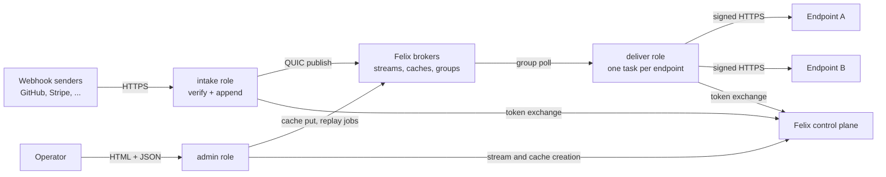
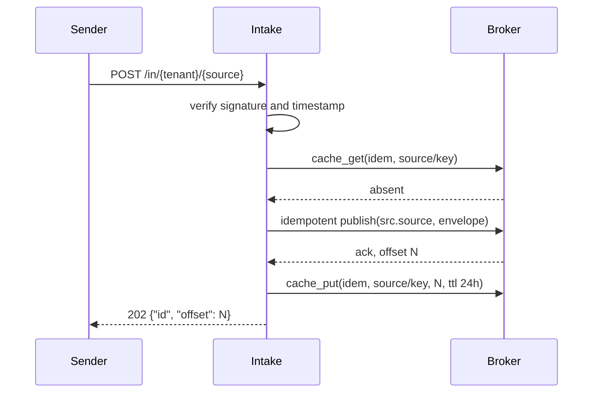
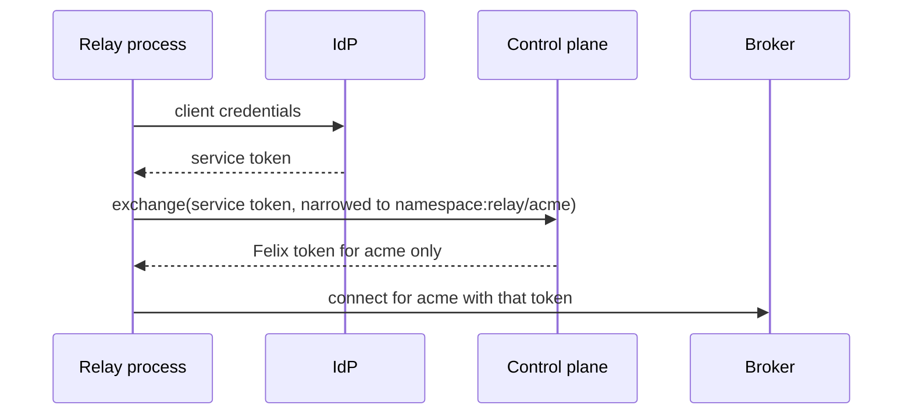

# Felix Webhook Relay design

A self-hosted webhook relay whose entire backend is [Felix](https://github.com/gabloe/felix).
It takes webhooks in over HTTP, stores them durably, delivers each one to its
endpoints with retries and backoff, sets aside what keeps failing, and replays
any endpoint from a point in time.

It exists to argue that consumer groups, acknowledgements, redelivery and
replay by offset are a product, not a feature list. A webhook relay is almost
nothing but those four things, which is why it is usually built from a queue,
a database and a scheduler glued together. The audience is an engineer about
to build that stack, or pay for a hosted one, who does not yet believe a log
can be the whole backend.

**In scope**

- HTTP intake per source, with signature verification for the common schemes (Standard Webhooks, GitHub, Stripe, a generic HMAC header)
- Durable storage of every accepted webhook before the sender gets a `2xx`
- Delivery to one or more endpoints per source, each signed with the endpoint's own secret
- Retries with backoff, a paused state for endpoints that are down, and dead letters for records an endpoint refuses
- Ordered delivery per endpoint by default, unordered with a concurrency window as an option
- Replay of an endpoint over a time range, and redrive of dead letters
- Multiple tenants, each confined to its own Felix namespace by the broker
- A small admin API and a plain server-rendered HTML page

**Out of scope**

- Transforming payloads. A relay that rewrites bodies has to answer for the rewrite; this one delivers the bytes it received
- Search over payloads or headers. Felix has no queries, and building an index would be a second datastore in disguise
- Exactly-once delivery. Nobody offers it over HTTP; the contract is at-least-once with a stable id per event
- Fanout to thousands of endpoints per source. Each endpoint is a consumer group, and the design is sized for tens per source
- Anything that needs a second datastore. If it cannot be expressed in Felix streams, caches, counters and consumer groups, it is out

## Success criteria

The project succeeds if seven demonstrations work in front of a skeptic.

| # | Demonstration | Passes when |
|---|---|---|
| 1 | Outage | An endpoint is down for an hour while 10,000 webhooks arrive. Within one backoff interval of it coming back, it receives all 10,000 in intake order. With no relay crash during the run, it sees no event id twice |
| 2 | Slow endpoint isolation | One endpoint answers every request after 10 s. Delivery p99 to the other endpoints on the same source stays within 10% of the run without it |
| 3 | Replay a time range | An operator replays one endpoint from 14:00 to 14:10. The endpoint receives exactly the webhooks the relay accepted in that window, in intake order, each marked as a replay, and live delivery carries on beside it |
| 4 | Signatures both ways | Intake answers `401` to a bad or stale signature in each supported scheme and nothing reaches the log. Every delivery verifies with an unmodified Standard Webhooks library |
| 5 | Crash anywhere | `kill -9` the intake, a delivery worker, or the broker owning a source (in a three-broker cluster) under load. No webhook that got a `2xx` from intake is lost, and repeats stay within the bound in [Delivery semantics](#delivery-semantics) |
| 6 | Dead letters | A record the endpoint answers with `400` is dead-lettered after its retry budget, the endpoint moves on to the next record, and a redrive after the fix delivers it |
| 7 | Tenant isolation | A delivery worker's Felix token for tenant A is refused by the broker on every stream and cache of tenant B, tested against the broker directly |

Two criteria are deliberately absent. Peak intake rate is not a goal: webhook
traffic is bursty but modest, and a relay that claims a million webhooks a
second is quoting its broker, not itself. Nor is endpoint count: a few hundred
endpoints per deployment is the target, and the design says where it stops
scaling.

## How these are normally built

Nothing here is a new idea about webhooks. The retry schedule, the signature
format and the dead-letter shape all come from relays that already exist. What
changes is what sits underneath, so it is worth being precise about what that
normally is.

Three shapes dominate:

| Shape | Examples | The backend is |
|---|---|---|
| Database as queue | Most in-house relays, many job frameworks | Postgres tables for events and attempts, workers taking rows with `SELECT ... FOR UPDATE SKIP LOCKED` |
| Queue plus database | Svix's open-source server, Convoy | A queue (Redis, SQS, RabbitMQ) for work, Postgres for the record of what happened |
| Hosted service | Svix, Hookdeck, Convoy Cloud | Someone else's queue and database, at a per-event price |

Self-hosted, the first two assemble from the same parts:

- **An intake tier** that writes the event to Postgres, then enqueues a job per endpoint.
- **A queue** holding those jobs, often with a delayed-job feature for retries.
- **A worker pool** that takes a job, sends the request, and writes the attempt back to Postgres.
- **A scheduler** or a `next_attempt_at` column polled on a timer, for retries hours out.
- **A replay feature** written as a query over the events table that re-enqueues jobs.

That stack works, and most relays you have used are built from it. Its seams
are in known places:

**Two systems must agree on every event.** The event is committed to Postgres
and the job to the queue, in two writes. Crash between them and you have an
event nobody delivers or a job for an event that does not exist. The usual fix
is an outbox table and a relay process that moves rows into the queue, which
is a third moving part built to paper over the first two.

**Ordering is a project.** A queue with competing workers delivers in whatever
order workers finish. Per-endpoint ordering means a lock or a partition per
endpoint, and most relays answer by not offering it.

**Retries cost writes.** Each attempt updates a row, and a scheduled retry is
a row a poller has to find again. An endpoint down for an hour with 10,000
events behind it is 10,000 rows rewritten every backoff step, at exactly the
moment you would like the database to be calm.

**Replay is a second delivery path.** Live delivery reads the queue; replay
reads the table and enqueues copies. Two code paths that must produce the same
request, against two sources that can disagree about what happened.

**A backlog is load.** Work for a dead endpoint sits in the queue, so a queue
sized for normal traffic fills with jobs that cannot run, and a single bad
endpoint can push everyone else's latency up.

### What changes when the substrate is a log

This design keeps the retry schedule and the signature format and replaces
what sits under them: one durable stream per source, one consumer group per
endpoint, and a few caches for configuration and state.

| Seam | Usual stack | Here |
|---|---|---|
| Event and job agree | Two writes, plus an outbox | One append. Each endpoint's group reads the same record |
| Per-endpoint ordering | A lock or a partition per endpoint | A group's cursor over one shard, read by one worker |
| Backlog during an outage | Jobs filling a queue, rows rewritten per retry | A cursor that has not moved. Nothing is written while it waits |
| Slow endpoint | Shares the worker pool and the queue | Its own group, its own cursor, its own task |
| Replay | A query that re-enqueues copies | A subscription from an offset over the same log |
| Lost worker | A visibility timeout per job | The group's visibility timeout, already the broker's job |
| Event storage | Rows, indexes, vacuum | Append-only segments with group commit |

The backlog row is the one that matters most. When an endpoint is down, the
relay does nothing at all for it beyond a probe on a timer. Its 10,000 pending
events are the stretch of log between its group's cursor and the tail, and
they cost the disk they were already using.

**What it costs.** The trade runs in both directions:

- **No queries.** "Every event from this customer with this header" is a table scan here, and the admin surface only finds events by offset, time or id from a record you already hold.
- **No compare-and-set.** Felix caches have last-writer-wins puts and nothing conditional. Idempotency keys race under concurrent retries, configuration edits are last-writer-wins, and endpoints are assigned to workers statically rather than by lease.
- **Retention is one dial per broker.** Felix applies `FELIX_DURABLE_RETENTION_SECONDS` to every stream it holds. How long an endpoint may stay down without losing events, and how far back a replay reaches, are both that one number.
- **Backoff is per endpoint, not per event.** An ordered endpoint with a failing head record waits as a whole. That is what ordering means, but it is a different model from per-message schedules, and the docs have to say so.
- **One source is one shard is one owning broker.** A single source's intake rate is bounded by one broker. Sources spread across a cluster; one source does not.
- **A stream per source costs a segment of disk.** A durable Felix stream preallocates its open segment, 256 MiB by default, so a few dozen sources reserve gigabytes before any webhook arrives. `FELIX_DURABLE_PREALLOCATE=false` or a smaller `FELIX_DURABLE_SEGMENT_BYTES` trades that away, broker-wide; the dev stack turns preallocation off.
- **A broker is still a cluster to run.** Svix self-hosted is Postgres and Redis, which every operator already knows. Felix is a broker and a control plane they probably do not.

## Architecture

One binary, `felix-relay`, runs in up to three roles. Everything else is Felix.

| Role | Holds state? | Responsibility |
|---|---|---|
| `intake` | No | Terminate senders' HTTP, verify the signature, dedupe on the idempotency key, append the envelope, answer `202` with the event id |
| `deliver` | Only what is in flight | One task per assigned endpoint: poll its group, send signed requests, retry, pause, dead-letter, ack; run replay and redrive jobs |
| `admin` | No | The JSON API and the HTML page: sources, endpoints, secrets, dead letters, replays, health |

**One binary with roles, not one binary per role.** The roles share the
envelope format, the configuration schema, the Felix connection and token
code, and the signing code. Splitting them into binaries buys nothing a role
flag does not: the image is the same, and a deployment still scales intake and
delivery separately by running `RELAY_ROLES=intake` on some replicas and
`RELAY_ROLES=deliver` on others. The default, `intake,deliver,admin`, is one
process for a small install.

The workspace has two crates. `core` is pure: the envelope, the signature
schemes, the retry and endpoint-health state machine, and the ordering rules.
No I/O, so the parts most likely to be wrong are unit-tested without a broker.
`relay` is the binary: axum, `felix-client`, and the three roles.

No role holds state a restart would lose. Intake answers `202` only after the
append is acknowledged. A delivery worker's only state is the records it has
claimed and not yet acknowledged, which the group hands out again if it dies.
The admin role reads everything from Felix on each request.

## Felix layout

Felix scopes everything `(tenant, namespace, name)`. The relay uses one Felix
tenant for the deployment (`relay` by default) and **one namespace per relay
tenant**. The namespace is what makes tenant isolation a broker check rather
than an application promise (see [Multi-tenancy and auth](#multi-tenancy-and-auth)).

Within a relay tenant's namespace:

| What | Felix primitive | Name | Notes |
|---|---|---|---|
| Accepted webhooks for one source | Durable stream, one shard | `src.<source>` | The log of record. Created with the source |
| One endpoint's delivery position | Consumer group on `src.<source>`, shard 0 | `ep.<endpoint>` | Cursor and dead letters replicate with the shard |
| Records the relay gave up on | Durable stream, one shard | `dead` | Envelope copy plus endpoint, attempts and last response |
| Delivery attempt log | Durable stream, one shard | `attempts` | One small record per attempt, published without waiting for an ack |
| Sources, endpoints, encrypted secrets | Cache, one shard | `config` | Keys `source/<id>`, `endpoint/<id>`. Workers hold a retained watch on the whole shard |
| Idempotency keys | Cache, with TTL | `idem` | Key `<source>/<key>`, value the event's offset, TTL 24 h |
| Endpoint health, replay jobs, dead-letter status | Cache, one shard | `state` | Keys `health/<endpoint>`, `job/<id>`, `dead/<offset>` |
| Counts for the dashboard | Counters in a cache | `stats` | `received/<source>`, `delivered/<endpoint>`, `failed/<endpoint>`, `dead/<endpoint>` |

**One stream per source, one shard each.** Felix orders records within a
shard (`docs/semantics.md`, ordering), and a consumer group is bound to the
shard the caller names (`docs/semantics.md`, "A group is bound to the shard
the caller names"). Per-endpoint ordering needs one total order per source, so
a source is one shard. Sources spread across brokers by name.

**One group per endpoint.** Two groups over one shard are independent and
each sees every record (`docs/semantics.md`, consumer groups). That is fanout
with independent cursors, retries and dead letters, for the price of one
append. A slow endpoint's cursor lags; nobody else's does.

**Why a separate `dead` stream when Felix groups have dead letters.** Felix
dead-letters a record only when its delivery count reaches
`FELIX_GROUP_MAX_ATTEMPTS` (default 5, `services/felix-broker-service/src/config/defaults.rs`),
counted at claim time (`crates/server/felix-broker/src/queue/tracker.rs`,
`GroupTracker::claim`). A consumer cannot dead-letter a record itself, and the
count is broker-wide. The relay's reason for giving up ("the endpoint said
`400` three times") is its own decision, so it records it in its own stream,
with the response that caused it. Felix's dead-letter list still matters: a
record that crashes the worker five times lands there, and the admin page
lists both (see [Dead letters](#dead-letters)).

**Configuration lives in a cache, not a stream.** Workers need the current
set of endpoints and changes as they happen. A retained watch on the `config`
cache gives exactly that: every current entry, then each change
(`crates/sdk/felix-client/src/client/cache_watch.rs`, `watch_cache_retained`).
A retained prefix watch reads one shard, so the cache has one.

**Secrets are encrypted by the relay.** Felix is not a secret store. Source
verification secrets and endpoint signing secrets are sealed with
XChaCha20-Poly1305 under `RELAY_SECRET_KEY` before they go into `config`, so a
cache read without that key yields nothing usable. The entry's cache key is
bound in as associated data, so a sealed secret copied into another entry
does not open. The relay refuses to start without the key.

### The envelope

Intake wraps each webhook in a MessagePack envelope before appending it:

| Field | Purpose |
|---|---|
| `id` | The event id. The sender's own id when the source names where to find it (`webhook-id`, `X-GitHub-Delivery`, a JSON path), else `<source>:<offset>` filled in by the worker from the record's offset |
| `received_at` | Unix milliseconds when intake accepted it. Felix stores an append timestamp but does not deliver it to consumers (`crates/sdk/felix-client/src/subscribe.rs`, `Event`), so the relay carries its own |
| `event_type` | Extracted per source config, for endpoint filters |
| `content_type` | Passed through to endpoints |
| `headers` | The sender's headers the source config chose to keep |
| `body` | The exact bytes received |

Felix's frame limit is 16 MiB (`FELIX_MAX_FRAME_BYTES`). Intake caps bodies
at 1 MiB by default, which is above what the common senders send.

The envelope is a MessagePack array in field order, not a map, so field names
are not repeated in every record: a 1 KiB body with a typical id, type and two
kept headers encodes in about 1,150 bytes. A field added later goes at the end
with a default, so records already in the log still decode. An absent `id`
is stored as nil, and every reader derives `<source>:<offset>` the same way
(`Envelope::event_id` in `core`).

## Intake

1. **Verify before anything is written.** The source names its scheme and secret. A bad signature or a timestamp outside five minutes is a `401`, and nothing reaches the log.
2. **Check the idempotency key**, when the source has one. The key is the sender's event id, so a source has one when its config says where the sender puts it (`event_id`, a header or a JSON path). A hit answers `200` with the original offset and appends nothing. Senders that retry reuse their id, which is exactly what the key needs.
3. **Append with an idempotent producer.** Felix's idempotent producer numbers each batch, so intake's own retry of a publish whose ack was lost lands once, across a failover (`crates/sdk/felix-client/src/publish/idempotent.rs`; `docs/semantics.md`, "Idempotent producers"). It also returns the offset on every ack, so the relay does not need the broker-wide `FELIX_ACK_ON_COMMIT` ([felix#956](https://github.com/gabloe/felix/issues/956)).
4. **Answer `202` only after the ack.** The ack is as durable as the broker's fsync policy (`docs/durable-storage.md`). The self-hosting guide recommends `FsyncMode::OnCommit`, where an ack means the bytes are on the device; group commit is what keeps that affordable.
5. **Never cancel an append.** Dropping an idempotent publish after it was sent and before its answer ends the producer (`IdempotentProducer::publish_batch`), and an HTTP handler is dropped whenever the sender hangs up. So the append runs on its own task, and a sender that disconnects still gets its webhook stored. A failed append is re-sent with the same bytes a few times, which cannot duplicate it. If it still fails, intake answers `503` and starts a new producer: the old batch is in doubt, so the sender's retry can land a second copy, and the sender's id is what tells the two apart.

**The idempotency check races.** Two copies of one webhook arriving at once
can both miss in `idem` and both be appended, because there is no conditional
put. The design accepts it: both carry the sender's id, so the endpoint's
dedupe on `webhook-id` absorbs the pair. Senders that retry concurrently are
rare; senders that retry after a timeout are common, and the check catches
those.

## Delivery

Each delivery process owns a fixed share of endpoints and runs one task per
endpoint. A task's loop:

1. Poll its group with `group_poll_wait` (`crates/sdk/felix-client/src/client/groups.rs`), up to a batch.
2. Skip records below the endpoint's `start_offset` and records its filter rejects, acknowledging them unsent.
3. Send each record, signed, and wait for the response.
4. On `2xx`, acknowledge. On failure, retry or pause as below.
5. Poll again only when nothing it holds is unsettled.

The last rule is the one the whole design rests on, and the reason is the
claim timer. A claimed record lapses after `FELIX_GROUP_VISIBILITY_TIMEOUT_MS`
(30 s by default) and becomes owed again, and the next poll hands owed records
out first, counting another attempt (`tracker.rs`, `claim` and `expire`).
Felix has no way to extend a claim and no delayed nack. So a worker that is
retrying a record past 30 s simply does not poll: nothing else reads its group,
the lapsed claim sits owed, and the attempt count does not move. When the
record finally succeeds, the worker acknowledges it. Felix accepts an
acknowledgement after the claim lapsed and settles the record
(`tracker.rs`, `GroupTracker::ack`, "Acknowledging something already settled
is not an error").

### Ordered and unordered endpoints

| Mode | In flight per endpoint | Ordering | Throughput ceiling |
|---|---|---|---|
| `ordered` (default) | 1 | Intake order, per source | One request per round trip to the endpoint |
| `unordered` | Up to the endpoint's window, default 16 | None | The window divided by the round trip |

Ordered is the default because it is the property the usual stack cannot give
cheaply and the one most receivers quietly assume. An endpoint that does not
care sets `unordered` and gets a window of concurrent requests. Both modes
follow the polling rule above, so an unordered endpoint works in rounds: it
polls a window, sends it all at once, settles what it can, and sends the rest
again after the longest wait any of them asked for, polling only once the
whole window is settled. An ordered endpoint is the same loop with a window of
one record, which keeps a single delivery path for both.

**Endpoints are assigned statically.** Each delivery process is started with
`RELAY_WORKER_INDEX` and `RELAY_WORKER_COUNT`, and owns the endpoints whose id
hashes to its index (FNV-1a, so every process agrees), like a StatefulSet
ordinal. `RELAY_ENDPOINT_PREFIXES` narrows a process to ids with given
prefixes, which lets a deployment give a group of endpoints delivery processes
of their own. The process watches config and starts a task per owned endpoint,
stops it when the endpoint is deleted, and restarts it when its source, mode
or window changes; everything else, the URL, secrets, filters and the
disabled flag, a task reads afresh before each request. A dynamic assignment needs a
lease, and a lease needs a conditional write Felix does not have. Two
processes started with the same index would both poll one group: no record is
lost, but ordering for those endpoints is gone and repeats rise. The admin
page shows which process last reported each endpoint, so the mistake is
visible.

### Starting at the right place

A Felix group that has never committed starts at the beginning of what the
log holds (`crates/server/felix-broker/src/queue/reader.rs`), and there is no
call to create a group at an offset. A new endpoint would otherwise receive
the source's whole history. So the admin role records `start_offset` in the
endpoint's config when it creates it: the source's tail at that moment, read
from `Subscription::live_offset()` after subscribing at `Latest`
(`crates/sdk/felix-client/src/subscribe.rs`). The worker acknowledges anything
below it without sending. "Start from the beginning" is a checkbox that sets
it to zero, which makes backfilling a new endpoint free.

The cost is that the group still walks the history once, acknowledging as it
goes. For a long-retained source that is a burst of acks at endpoint creation.

## Delivery semantics

**At-least-once, with a stable id.** Every request carries `webhook-id`, the
envelope's `id`, and the same id on every attempt, replay and redrive. A
receiver that dedupes on it sees each event once.

**When a receiver sees an id twice:**

- The worker lost its connection or died after the endpoint answered `2xx` and before the ack reached the broker. Bounded by the endpoint's in-flight window: one record for an ordered endpoint.
- The broker leading the source failed over. The in-flight set is not durable (`docs/semantics.md`, "The in-flight set is deliberately not durable"), so records between the group's cursor and its acknowledgements are delivered again. The cursor moves over contiguous acks, so for an ordered endpoint this is again about one window.
- The sender sent it twice without a stable id. Intake cannot tell; the endpoint sees two ids.
- A replay or redrive, which is deliberate and marked with `webhook-replay: <job>`.

With no crash, no failover and a sender that supplies ids, a receiver sees no
repeats. That is what demonstration 1 checks.

**Ordering, exactly.** For an ordered endpoint, the relay does not send record
`b` until every record before it in the source's log has been acknowledged by
the endpoint, dead-lettered, or filtered out. A repeat after a crash can show
an earlier record again after a later one; dedupe on `webhook-id` hides it.
Replays and redrives run in their own lane and are not ordered against live
delivery.

### Retries, pausing and backoff

Failures split by what they say about the endpoint:

| Response | Reads as | What happens |
|---|---|---|
| `2xx` | Delivered | Acknowledge |
| `400` to `499`, except `408`, `425`, `429` | This record is refused | Try it three times: at once, after 5 s, and after 30 s more. Then dead-letter it and move on |
| `408`, `425`, `429`, `5xx`, timeout, connection error | The endpoint is unwell | Pause the endpoint and probe with the same record on the backoff schedule |
| `410 Gone` | The endpoint is retired | Disable the endpoint at once |

**Backoff is per endpoint.** A paused endpoint probes with its head record at
5 s, 15 s, 1 min, 2 min, then every 5 minutes, each with up to 20% jitter. A
`Retry-After` header in seconds and within an hour is honoured; the
HTTP-date form falls back to the schedule. While paused it polls
nothing, so its group's cursor holds still and its backlog grows in the log at
no cost. When a probe succeeds, it delivers what it holds and resumes polling.
An operator can press "retry now" on the admin page to skip the wait.

An unordered endpoint can tell the two cases apart more often: if other records
in its window succeed while one keeps failing with `5xx`, that record is
treated as refused and dead-lettered after its three tries, rather than
pausing everyone. Once it has been counted as refused it keeps counting that
way when it is the only one left in hand, since it no longer has neighbours to
compare with. An ordered endpoint has only one record in flight and cannot
tell; it pauses.

**Disable after three days.** An endpoint that has failed continuously for
`RELAY_DISABLE_AFTER` (72 h by default) is disabled, not drained into dead
letters. Its records stay in the log behind its cursor, and re-enabling it
resumes delivery from there, provided retention has not removed them. That
proviso is the honest limit of the design: **broker retention must exceed the
disable window plus the replay window**, and the relay checks the gap it can
see (it warns when the oldest record it can read is younger than the window).

Disabling is written where an operator sees it: the worker sets `disabled`
(a reason and a time) on the endpoint's config entry, and
`POST /api/<tenant>/endpoints/<id>/enable` clears it. Meanwhile the worker
keeps the records it had claimed in hand and polls nothing, so enabling
resumes with the record that failed, from the cursor.

**What a worker writes.** One `Attempt` per request to `attempts`, published
with no acknowledgement, since it is a trail and not a record of truth. One
`DeadLetter` per given-up record to `dead`, through the idempotent producer,
before the record is acknowledged. And `state/health/<endpoint>` as JSON
every 3 s and at once on a state change: the state, when the current run of
failures began, the last error, the last acknowledged offset, the gaps it
has seen (felix#963) and which process reported it.

Each request times out after 15 s by default. Deliveries never follow
redirects.

### Dead letters

A dead letter comes from one of two places:

| Where | Why | Redrive |
|---|---|---|
| The relay's `dead` stream | The endpoint refused the record after its retry budget | The admin role writes a redrive job. The endpoint's worker delivers the envelope copy and marks `dead/<offset>` done |
| Felix's group dead-letter list | The record was claimed `FELIX_GROUP_MAX_ATTEMPTS` times without an ack, which means workers kept dying on it | `group_redrive`, which puts it back in play for the same group (`groups.rs`; `docs/auth.md` for `group.manage`) |

The second kind should be rare and loud. It means a record crashes the worker,
and the admin page shows it in red with the offset to investigate.

A dead letter carries a copy of the envelope, not just the offset, so a redrive
still works after retention trims the source.

### The two group gaps, and how the design copes

Two open Felix issues touch delivery directly.

**[felix#962](https://github.com/gabloe/felix/issues/962): a restarted member
cannot take back its predecessor's claims.** Claims carry no consumer
identity, so a worker that restarts gets newer records first, and the records
its previous run had claimed come back only when their claims lapse, up to
30 s later. For an ordered endpoint that would deliver out of order. So a
delivery task **waits out the visibility timeout before its first poll**
(`RELAY_CLAIM_WAIT_MS`, default 30,000, which must match the broker's
`FELIX_GROUP_VISIBILITY_TIMEOUT_MS`). After the wait every old claim is owed,
owed records are handed out first and in offset order, and the endpoint
resumes where it was. The cost is a 30 s pause per endpoint on every restart
and deploy. When #962 lands, the worker polls under a stable consumer
identity, `<worker index>/<endpoint>`, and the wait goes away.

**[felix#963](https://github.com/gabloe/felix/issues/963): group records do
not say how many offsets were skipped.** The broker settles generation-start
records and retention-trimmed records without delivering them, so a hole in
the offsets a group hands out is not necessarily a loss. The relay therefore
cannot check contiguity by offset, and does not try. Ordering comes from the
polling rule instead: one consumer per group, never polling with anything
unsettled, so each poll hands out the lowest owed and unclaimed offsets in
order. What the relay loses is detection: a record trimmed by retention before
an endpoint reached it vanishes silently for that endpoint. Felix counts it
(`trimmed_skipped`) but does not tell the consumer. Until #963 lands, the relay
compares each record's offset to the last one it handled and, when the jump is
more than one, records the hole on the endpoint's health entry as "possibly
trimmed" for an operator to check against retention.

## Replay

Felix has no way to find an offset by time on its native API. Records carry
an append timestamp in storage, and the Kafka listener answers offset-for-time
by binary search over it (`docs/kafka-compatibility.md`), but `subscribe_from`
takes `Latest`, `Earliest` or an offset only
(`crates/protocol/felix-wire/src/client/message/fields.rs`, `StartPosition`).

**The log is its own index.** Offsets in a source's stream rise with
`received_at`, give or take the few milliseconds two intake processes can
interleave. To find the first offset at or after time `T`, the admin role
binary-searches the stream: subscribe from a midpoint offset, read one
envelope, compare its `received_at`, repeat. A 10-million-record stream takes
about 24 reads. The search aims at `T` minus five seconds, and the replay
filters by `received_at`, so interleaving cannot drop an edge record. The end
of a range is found the same way, aiming five seconds past it. Each read opens
a subscription at the probe offset and takes the first record it gets, which
also steps over offsets the broker never delivers. On the dev stack a read
costs about 12 ms, so a million records resolve in about 250 ms (see the
performance doc for the 10-million figure).

A replay job is a cache entry, `state/job/<id>`: the endpoint, the offset
range, the next offset, and a status. The endpoint's worker runs it with a
plain subscription from the start offset to the end offset, not through the
group, so the live cursor is untouched. It signs each request with the
endpoint's current secret, adds `webhook-replay: <job>`, and writes the next
offset back to the job every 100 records. A worker that dies resumes the job
from its last checkpoint, so a replay repeats at most 100 records.

Replays share the endpoint, not its order. A replay sends one request at a
time, interleaved with live traffic, whatever the endpoint's mode; a quarter
of an unordered endpoint's window was the plan, and one at a time proved
enough to show replays and is simpler to bound. Its retries follow the same
state machine as live delivery, except that it never disables the endpoint:
it fails the job instead. Pausing live delivery during a replay is an option
on the job (`pause_live`), for receivers that need the replayed range to land
first; the live task then waits before its next poll. A finished job stays in
the cache for a week, then expires.

A redrive is a job too, `{"type": "redrive", "dead_offset": N}`. The worker
reads the dead letter's envelope copy from `dead`, delivers it with the same
event id and `webhook-replay: <job>`, and marks `state/dead/<N>` redriven.
Discarding only writes the mark. Felix's own group dead letters are redriven
or discarded with `group_redrive` and `group_discard`, which need
`group.manage` on the source's stream.

A replay cannot reach below retention. The admin page shows the oldest offset
and time each source still holds.

## Signing

Deliveries follow [Standard Webhooks](https://www.standardwebhooks.com/):
`webhook-id`, `webhook-timestamp`, and `webhook-signature` as `v1,` plus the
base64 HMAC-SHA256 of `id.timestamp.body` under the endpoint's `whsec_`
secret. During a secret rotation both signatures are sent for 24 hours, which
the spec allows. Using the spec rather than a relay-specific header means
receivers verify with an existing library, which is what demonstration 4
checks.

Intake verifies four schemes in M1: Standard Webhooks, GitHub's
`X-Hub-Signature-256`, Stripe's `Stripe-Signature` with its timestamp
tolerance, and a generic HMAC-SHA256 header with a configurable name, hex or
base64. A source with no scheme must use a long random token instead, sent as
the last path segment, `/in/<tenant>/<source>/<token>`, and the admin page
says plainly that it is weaker. The relay never logs request paths or puts
them in metrics, and a test checks the token stays out of a trace-level log,
but a proxy in front of the relay may still log the URL. The unit tests use the published vectors for
Standard Webhooks and GitHub; Stripe documents its construction but not a
vector with a known secret, so its vector was computed outside the relay.

## Multi-tenancy and auth

A relay tenant is a Felix namespace, and every Felix connection the relay opens
for tenant work carries a token **narrowed to that namespace**. This is what
felix-canvas learned building per-room authorization, applied one level up.

1. Each relay process authenticates as a service principal at the deployment's IdP with the client credentials grant.
2. For each tenant it serves, it exchanges that token at the Felix control plane, narrowing to `namespace:relay/<tenant>` and to the actions its role needs: intake asks for `stream.publish`, `cache.read`, `cache.write`; delivery for `stream.subscribe` (which includes `group.consume`), `stream.publish`, `cache.read`, `cache.write`; admin adds `group.manage`, to redrive and discard Felix's group dead letters.
3. The control plane cuts a `stream:relay/*/*` grant down to `stream:relay/<tenant>/*` (`services/felix-controlplane-service/src/auth/rbac/authorize.rs`, `narrow_object`). The narrowing survives refresh (`docs/auth.md`, refresh).
4. The process opens one Felix connection per tenant with that token.

So a bug that routes tenant A's work through tenant B's connection is refused
by the broker, not caught by an `if`. Demonstration 7 tests that against the
broker directly, with no relay code in the path.

The cost is a QUIC connection per tenant per process. That is fine for tens
or low hundreds of tenants and is the first thing to revisit beyond that.

**Cache grants are per cache, not per key.** Felix authorizes `cache:t/ns/name`
as a whole (`docs/auth.md`, objects). That is why each tenant has its own
`config`, `idem`, `state` and `stats` caches inside its namespace rather than
sharing deployment-wide ones keyed by tenant. It also means nothing finer than
a tenant can be enforced by Felix: within a tenant, every endpoint's worker can
read every endpoint's config. Per-endpoint isolation inside a tenant is out of
scope for that reason.

**Admins sign in with the IdP too.** The admin role uses the authorization code
flow server-side, with the session in an encrypted cookie, so it stores
nothing. Each request exchanges the admin's token narrowed to the tenant they
opened. Who may administer a tenant is a Felix RBAC role,
`role:relay-tenant-<tenant>`, granting the namespace's streams and caches plus
`stream.manage` and `cache.manage` for creating sources. The control plane
refuses the exchange for anyone else, the same model as felix-canvas's
per-room roles.

**Creating a source creates Felix resources.** Streams and caches are created
only through the control plane's REST API
(`services/felix-controlplane-service/src/api/streams.rs`); the client cannot.
The admin role makes those calls with the admin's narrowed token, so creating
a source needs `stream.manage` on the tenant's namespace, which the tenant
admin role grants.

## Admin surface

A small JSON API and a plain HTML page served by the same axum router. The
page is server-rendered HTML with a stylesheet and a few lines of inline
JavaScript for the live counters. No npm, no build step, nothing to download
at build time beyond crates.

| Route | What |
|---|---|
| `GET /admin/<tenant>` | Sources and endpoints with health, lag and counts |
| `POST /api/<tenant>/sources`, `PUT`, `DELETE` | Manage sources; creating one creates its stream |
| `POST /api/<tenant>/endpoints`, `PUT`, `DELETE` | Manage endpoints, including mode, window, filter, `start_offset` |
| `POST /api/<tenant>/endpoints/<id>/secret` | Rotate a signing secret |
| `POST /api/<tenant>/endpoints/<id>/retry` | Skip the backoff wait |
| `POST /api/<tenant>/endpoints/<id>/enable` | Enable a disabled endpoint |
| `POST /api/<tenant>/endpoints/<id>/replays` | Start a replay over a time (`since`, `until`, Unix ms) or offset (`from`, `to`) range |
| `GET /api/<tenant>/jobs/<id>` | A replay or redrive job |
| `GET /api/<tenant>/sources/<id>/offset?at=<ms>` | The first offset received at or after a time |
| `GET /api/<tenant>/dead` | The newest 200 of the relay's dead letters with their marks, and Felix's group dead letters per endpoint |
| `POST /api/<tenant>/dead/<offset>/redrive`, `.../discard` | Act on one of the relay's dead letters |
| `POST /api/<tenant>/endpoints/<id>/broker-dead/<offset>/redrive`, `.../discard` | Act on one of Felix's |
| `GET /api/<tenant>/events/<source>/<offset>` | One event, its envelope, and its recent attempts |
| `GET /healthz`, `GET /metrics` | Liveness and Prometheus metrics, per role |

**The JSON API comes before the page and sign-in.** Sources and endpoints
have to be written somewhere from M1 on, so the routes that write them land
first, with no sign-in and the relay's own Felix connection. Until sign-in
lands, a process running the admin role refuses a non-loopback `RELAY_LISTEN`
unless `RELAY_ADMIN_ALLOW_PUBLIC=true` says something in front of it
authenticates. A secret given to the
API is sealed before it is written and never shown again; one the relay makes
up is shown once, in the answer that created it.

**Lag is computed, not read.** Felix has no client call for a group's cursor
(`committed` is broker-internal, `reader.rs`). Each worker writes its last
acknowledged offset to `state/health/<endpoint>` every few seconds, and the
page shows the source's tail minus that. It is a few seconds stale, which is
fine for a dashboard.

**Counts are approximate.** Felix counters are at-least-once
(`crates/sdk/felix-client/src/client/cache.rs`, `counter_add`): a retried add
counts twice. The dashboard labels them as counts, and the log is the record.

**Deleting an endpoint leaves its group behind.** Felix has no call to delete a
consumer group. The relay deletes the config and stops polling; the group's
cursor stays in the broker's group log, idle and small.

## Failure modes

| Failure | What Felix does | What the relay does | What a sender or receiver sees |
|---|---|---|---|
| Endpoint down | Nothing; the group's cursor waits | Pauses the endpoint, probes on the backoff schedule | Every event, in order, after it returns |
| Endpoint slow | Nothing | Only that endpoint's task waits | Other endpoints unaffected |
| Endpoint refuses one record | Nothing | Three tries, then the `dead` stream, then the next record | One event missing until redrive |
| Delivery worker dies | Claims lapse after 30 s and become owed | The replacement waits 30 s (felix#962), then resumes | A pause, and at most one window repeated |
| Worker crashes on one record repeatedly | Dead-letters it after 5 claims | Shows it on the admin page as a broker dead letter | That event stops until redrive |
| Intake dies mid-request | A publish either landed or did not | The sender retries; idempotent producer and `idem` absorb most repeats | A retry, as with any relay |
| Owning broker lost | Reassigns the shard; group cursor and dead letters move with it | Reconnects; intake retries the publish | A stall of about the failover window; a few repeats from the in-flight set |
| Endpoint down longer than retention | Trims records the group has not reached and skips them | Records a "possibly trimmed" hole on the endpoint (felix#963) | Lost events, visible on the admin page |
| Two workers with one index | Splits the group between them | Nothing stops it; the admin page shows two reporters | Out-of-order and repeated events for those endpoints |
| Control plane down | Brokers keep serving existing tokens | Workers keep running until a refresh fails; admin cannot create sources | Nothing, for up to a token lifetime |

**Every recovery path is the group.** A dead worker, a failed-over broker and a
restarted deployment all resume the same way: poll the group, get what is owed
first. One mechanism, exercised on every deploy, rather than a scheduler, an
outbox and a reconciliation job.

## Performance targets

Set by what senders and receivers notice, not by Felix's ceilings.

| Path | Target | Measured how |
|---|---|---|
| Intake, request to `202`, in-region, fsync on commit | < 10 ms p50, < 30 ms p99 | Load generator against intake, 1 KiB bodies |
| Intake throughput, one process | 5,000 webhooks/s at 1 KiB | Same, until p99 crosses 30 ms |
| Accept to endpoint receipt, healthy endpoint | < 50 ms p50, < 250 ms p99 | Timestamp in the body, receiver on the same host |
| One endpoint slowed to 10 s | Others' p99 within 10% | Demonstration 2 |
| Drain after an outage, ordered | Bounded by the endpoint: one request per round trip | Demonstration 1 |
| Drain after an outage, unordered, window 16 | 16 requests in flight sustained | Same, with `unordered` |
| Endpoints per delivery process | 1,000 idle, 200 active | Each idle endpoint costs one waiting poll |
| Offset for a time in a 10M-record source | < 1 s | Binary search, about 24 reads |

**Budget the hop.** Of the 50 ms accept-to-receipt target, Felix's own share
is a millisecond or two in-region with fsync on commit. The rest is the
group's poll wake-up, the HTTP request to the endpoint, and the endpoint
itself. Intake, the poll and the outbound request are separate
histograms on `/metrics`, so the broker's share is a number, not a guess:
`relay_intake_ack_seconds` from starting an append to its ack,
`relay_poll_wakeup_seconds` from `received_at` to the poll that hands the
record out, and `relay_outbound_request_seconds` per request to an endpoint.
The poll histogram uses intake's clock against the worker's, so across hosts
it includes their clock skew.

**Intake throughput needs batching.** An idempotent producer serialises its
publishes to a stream, and intake has one producer per process, so today it
appends one webhook per broker round trip. The 5,000 per second target needs
concurrent webhooks gathered into one `publish_batch`, which takes one
sequence whatever its size. That is M6 work; M0 appends one at a time.

## Build order

| M | Milestone | Proves | Rough size |
|---|---|---|---|
| 0 | Intake appends, one worker delivers, one hardcoded source and endpoint | A webhook goes in and comes out through Felix | 3 to 5 days |
| 1 | Signature verification on intake, Standard Webhooks signing on delivery, idempotency keys | Demonstration 4 | 1 week |
| 2 | Retries, pausing, backoff, dead letters, the claim wait | Demonstrations 1 and 6 | 1 to 2 weeks |
| 3 | Many sources and endpoints from config, ordered and unordered modes, static assignment | Demonstration 2 | 1 week |
| 4 | Replay by time range, redrive | Demonstration 3 | 1 week |
| 5 | Tenants as namespaces, narrowed tokens, the admin API and page | Demonstration 7 | 1 to 2 weeks |
| 6 | Crash and failover tests in a three-broker cluster, the performance targets | Demonstration 5 and the targets | 1 week |
| 7 | Release images, a compose install, a Helm chart, a self-hosting guide | Anyone can self-host it | 1 week |

**M0 is the one to start first.** It settles the parts everything else depends
on: the envelope, the idempotent publish, and a worker that polls, sends and
acks. A relay with one hardcoded endpoint is already useful for a demo.

**M2 is the first genuinely convincing demo.** An endpoint down for an hour
that gets everything back in order, with nothing written while it waited, is
the argument in one picture.

The honest total is 8 to 10 weeks of evenings for one person. Unlike the
canvas there is no large frontend to swallow time, so the risk is in the
delivery state machine, which is why it lives in a pure crate with its own
tests from M0.

## Self-hosting

Mirrors felix-canvas's packaging, in M7:

- **One image**, `ghcr.io/gabloe/felix-webhook-relay`, multi-arch, built on native runners and signed like Felix's own images. `RELAY_ROLES` picks the roles.
- **A compose file** with the Felix broker and control plane at a pinned version, the relay in all three roles, and a stand-in IdP for a first run. Felix still needs an IdP to issue any token ([felix#954](https://github.com/gabloe/felix/issues/954)).
- **A Helm chart** with intake as a Deployment and delivery as a StatefulSet, so the ordinal is `RELAY_WORKER_INDEX`.
- **A self-hosting guide** listing every variable, the IdP registration, the Felix roles each tenant needs, and the two broker settings the relay depends on: retention longer than the disable window plus the replay window, and `RELAY_CLAIM_WAIT_MS` equal to `FELIX_GROUP_VISIBILITY_TIMEOUT_MS`.

A standalone dev broker reads its node token once, so the dev stack sets
`FELIX_EXCHANGE_TOKEN_TTL_SECONDS=86400` as felix-canvas does
([felix#955](https://github.com/gabloe/felix/issues/955)). It also sets
`FELIX_GROUP_VISIBILITY_TIMEOUT_MS=5000`, so tests see claims lapse while a
worker retries, and a relay on it can use `RELAY_CLAIM_WAIT_MS=5000`.

## Risks, and what this surfaces in Felix

The real risk is the delivery state machine. Pausing, probing, ordering, the
claim wait and the polling rule interact, and a mistake shows up as an event
delivered twice or out of order under a crash nobody reproduced. The
mitigation is the pure `core` crate, where the state machine is tested against
simulated responses and simulated claim lapses, and M6's crash tests against
real brokers.

- Retention set too short. Then outages and replays lose events. The relay warns, but it cannot change the broker's setting.
- Static assignment misconfigured. Two workers on one index break ordering. Detected, not prevented.
- The 30 s restart pause. Every deploy stalls every endpoint for 30 s until felix#962 lands. Acceptable for webhooks, but visible.
- Group walk on endpoint creation. A long-retained source makes creating an endpoint expensive until Felix can start a group at an offset.

**Felix gaps this design works around:**

| Gap | Workaround here | Upstream |
|---|---|---|
| A restarted member cannot reclaim its predecessor's claims | Wait out the visibility timeout before the first poll | [felix#962](https://github.com/gabloe/felix/issues/962) |
| Group records do not say how many offsets were skipped | Order by the polling rule; flag holes as "possibly trimmed" | [felix#963](https://github.com/gabloe/felix/issues/963) |
| No claim extension and no delayed nack | Never poll while holding a lapsed claim; rely on a late ack being accepted | Not filed |
| A consumer cannot dead-letter a record; attempts and timeout are broker-wide | The relay's own `dead` stream | Not filed |
| A group cannot start at an offset, be reset, or report its cursor | `start_offset` in config, skipped with acks; lag from the worker's own report | Not filed |
| No consumer group deletion | Leave idle groups behind | Not filed |
| No offset-for-time on the native API, and consumers never see the append timestamp | `received_at` in the envelope and a binary search over the log | Not filed |
| No conditional cache put | Idempotency check races; static endpoint assignment; last-writer-wins config | Not filed |
| Retention is broker-wide only | Document it and warn | Not filed |
| Segment size and preallocation are broker-wide, so each stream reserves a full segment | Document the disk cost per source; dev stack turns preallocation off | Not filed |
| Streams and caches created only through the control plane | The admin role calls the REST API | By design |
| Offsets on acks need a broker-wide setting | Idempotent producer returns them | [felix#956](https://github.com/gabloe/felix/issues/956) |

**What this project would contribute upstream to Felix:**

1. **Consumer identity on group polls**, which is felix#962's fix and would also let the admin page show which worker holds which claim.
2. **Group control**: create at an offset or at the tail, reset to an offset, read the cursor, delete. Every queue-shaped application needs these.
3. **Offset for a time** on the native API. The broker already does it for Kafka clients.
4. **A conditional cache put**, which turns the cache into something leases and idempotency keys can be built on.

**Open questions**

- [ ] Does the relay's own `dead` stream earn its place once Felix lets a consumer dead-letter a record with a reason, or should it move onto Felix's list then?
- [ ] Is one Felix connection per tenant per process acceptable at a few hundred tenants, or does that force a shared connection with per-request tokens upstream?
- [ ] Should a source be allowed more than one shard, with ordering per shard key, for senders whose rate one broker cannot hold?
